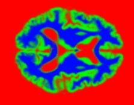

# Diffeomorphic shape modelling



This software implements a statistical shape model based on diffeomorphic transforms.

Learning shape parameters &ndash; _i.e._, a mean shape (or template) and a principal space of deformation &ndash; from a series of 2D or 3D images is cast as a maximum _a posterori_ inferrence problem in a graphical model.

This repository contains core functions and executable scripts written in Matlab.

## Standalone release

> TODO - there's no such release yet

We provided compiled command line routines that can be used without Matlab license. To use them, you must:
- Install [Matlab runtime](https://uk.mathworks.com/products/compiler/matlab-runtime.html)
- Download your [platform release](https://github.com/WTCN-computational-anatomy-group/shape-toolbox/releases)
- Run the train or fit functions in a terminal:
  ```shell
  ./run_pgra_train /path/to/matlab/runtime input.json option.json
  ```
  ```shell
  ./run_pgra_fit /path/to/matlab/runtime input.json option.json
  ```
  ```shell
  ./run_pgva_train /path/to/matlab/runtime input.json option.json
  ```
  ```shell
  ./run_pgva_fit /path/to/matlab/runtime input.json option.json
  ```

### Basic use cases

The illustrative JSON files are commented. However, comments are not allowed in JSON, so they should be removed from any _real_ file.

**Learn a shape model from grey and white matter segmentations obtained with SPM's _New Segment_**

`input.json`
```
{"f": [["rc1_sub001.nii","rc2_sub001.nii"],     // Grey and white classes for the first subject
       ["rc1_sub002.nii","rc2_sub002.nii"],
       ["rc1_sub003.nii","rc2_sub003.nii"],
       ...
       ["rc1_sub100.nii","rc2_sub100.nii"]]}    // Grey and white classes for the last subject
```

`option.json`
```
{"dir":   {"model": "~/my_shape_model/",        // Write all (model and subject) data in the same folder
           "dat":   "~/my_shape_model/"},
 "model": {"name": "categorical",               // Observed images are segmentations
           "nc":   3},                          // There are 3 classes, even though only 2 were provided.
                                                //   This allows the third class to be automatically created 
                                                //   by "filling probabilities up to one"
 "pg":    {"K": 32},                            // Use 32 principal components
 "split": {"par": 0}                            // Do not use parallelisation 
 }
```

Command line
```shell
./run_pgra_train /path/to/matlab/runtime input.json option.json
```

**Apply a shape model to grey and white matter segmentations obtained with SPM's _New Segment_**

`input.json`
```
{"f": [["rc1_sub101.nii","rc2_sub101.nii"],     // Grey and white classes for the first subject
       ["rc1_sub102.nii","rc2_sub102.nii"],
       ["rc1_sub103.nii","rc2_sub103.nii"],
       ...
       ["rc1_sub200.nii","rc2_sub200.nii"]],    // Grey and white classes for the last subject
 "w": "~/my_shape_model/subspace.nii",          // Learnt principal subspace
 "a": "~/my_shape_model/log_template.nii"}      // Learnt log-template
```

`option.json`
```
{"dir":   {"model": "~/normalised_images/",     // Write all (model and subject) data in the same folder
           "dat":   "~/normalised_images/"},
 "model": {"name": "categorical",               // Observed images are segmentations
           "nc":   3},                          // There are 3 classes, even though only 2 were provided.
                                                //   This allows the third class to be automatically created 
                                                //   by "filling probabilities up to one"
 "pg":    {"K": 32},                            // Use 32 principal components
 "z":     {"A0": [0.0016, 0.0030, ...]},        // Diagonal elements of the latent precision matrix
 "r":     {"l0": 18.8378},                      // Residual precision
 "split": {"par": 0}                            // Do not use parallelisation 
 }
```

Command line
```shell
./run_pgra_fit /path/to/matlab/runtime input.json option.json
```

## The model

This work relies on a generative model of shape in which individual images (of brains, in particular) are assumed to be generated from a mean shape &ndash; commonly named template &ndash; deformed according to a transformation of the coordinate space. Here, these transformations are diffeomorphisms, _i.e._, one-to-one invertible mappings that allow for very large deformations. By using the _geodesic shooting_ framework, we parameterise these transformations by their _initial velocity_, which can be seen as an infinitesimal (very small) deformation. The _a posteriori_ covariance structure of these velocity fields is infered by making use of a technique related to the well-known _principal component analysis_, adapted to the particular structure of the space on which lie velocity fields, called a Riemannian manifold. Our model also includes a rigid-body transform, whose role is to factor out all deformations induces by brains misalignment.

Inputs can be binary or categorical images (_i.e._, segmentations), in which case a Bernoulli or Categorical data term is used, or multimodal intensity images, in which case a uniform Gaussian or Laplace noise data term is used.

All considered, the following variables are infered:
- `W = [w1 .. wK]`: the principal subspace of deformation, made of K _principal geodesics_ ;
- `z`: transformation coordinates in the principal subspace, which is a low-dimensional representation of each subject in terms of deformation of the template ;
- `A`: the precision matrix (_i.e._, inverse covariance) of the latent coordinates. At the optimum, it should be a diagonal matrix that contains the variance along each principal component, or in other words, their scale ;
- `v`: the velocity field of each subject. It is only an explicit random variable in the PGVA model, in which case the residual field, `r = v - Wz`, can be recovered by substracting the principal representation ;
- `r`: alternatively, the residual field can be explicitely infered, as is the case in the PGRA model. Then, the initial velocity is reconstructed according to `v = Wz + r` ;
- `lam`: the precision of the residual field, also named _anatomical noise_ ;
- `q`: parameters of the rigid-body transform. Note that there are options to use different kind of affine transforms instead, however it is not advised, as differences in size should be captured by the shape model.

The following parameters are manually set and impact the model's behaviour:
- `K`: the number of principal components ;
- `L`: a Riemannian metric, in the form of a mixture of membrane, bending and linear-elastic energies. A small penalty on absolute displacements should also be set in order to ensure the diffeomorphism to be invertible and that it can be _shot_ with a low number of  integration steps ;
- `A0` and `n0`: the prior expected value of the latent precision matrix and its degrees of freedom, which should be seen as the virtual number of subjects that weight this prior belief ;
- `l0` and `n0`: the prior expected value of the residual precision matrix and its degrees of freedom, which should be seen as the virtual number of subjects that weight this prior belief ;

### PGVA vs PGRA

- The PGVA model (Principal Geodesic from Velocity + Affine) fits velocity fields before updating the principal subspace and latent coordinates accordingly.

  Pros:
  * The principal subspace and latent coordinates have closed-form update equations, meaning that only initial velocities are fit by Gauss Newton (and Laplace approximated).

  Cons:
  * Since latent coordinates are obtained from velocity fields, it might take a few iterations before the shape model appropriately captures the main modes of variation.
 
- The PGRA model (Principal Geodesic + Residual field + Affine) directly fits the different components of velocity fields &ndash; subspace, latent coordinatesm residual field &ndash; using Gauss-Newton optimisation.

  Pros:
  * Principal directions are directly picked up by optimising the data term, which might be faster and more robust.
  
  Cons:
  * Laplace approximations are used for both the residual field and latent coordinates.
  * A line search is necessary when updating the principal subspace, which is quite costly as we need to reshoot all diffeomorphisms for each factor of the line search.

Both strategies have advantages and drawbacks. We plan to make a thorough and quantitative evaluation of both models in order to propose rationale principles for choosing one or the other depending on the context and aplication.

## User documentation

### Input format

If you use compiled routines or their Matlab equivalents ([pgra_train](scripts/pgra/pgra_train), [pgra_fit](scripts/pgra/pgra_fit), [pgva_train](scripts/pgva/pgva_train), [pgva_fit](scripts/pgva/pgva_fit)), inputs should be JSON files containing dictionaries. These routines wrap around the main scripts ([pgra_model](scripts/pgra_model),[pgva_model](scripts/pgva_model)).

If you directly use the main scripts in Matlab, inputs are structures.

Regarding of the above choice, there are one mandatory input and one optional one:
- `input`: \[mandatory\] a dictionary of filenames with fields:
  * `'f'`: observed images (list or matrix, the first dimension is for subjectsm the second for classes or modalities) ;
  * `'v'`: \[PGVA only\]  observed velocity fields (list)
  * `'w'`: principal subspace to use or initialise with
  * `'a'`: \[Bernoulli/Categorical only\] log-template to use or initialise with
  * `'mu'`: \[Gaussian/Laplace only\] template to use or initialise with
- `opt`: \[optional\] a dictionary of options
  * All possible fields are provided below.

### Options

Options will be provided in their Matlab structure form. Their JSON equivalent are dictionaries whose keys are the structure field names.

#### Model

```
model.name     - Generative data model ('normal'/'categorical'/'bernoulli') - ['normal']
model.sigma2   - If normal model: initial noise variance estimate           - [1]
model.nc       - [categorical only] Number of classes                       - [from input]
pg.K           - Number of principal geodesics                              - [32]
pg.prm         - Parameters of the geodesic operator                        - [1e-4 1e-3 0.2 0.05 0.2]
pg.bnd         - Boundary conditions for the geodesic operator              - [1 = circulant]
pg.geod        - Additional geodesic prior on velocity fields               - [true]
tpl.vs         - Lattice voxel size                                         - [auto]
tpl.lat        - Lattice dimensions                                         - [auto]
tpl.bnd        - Boundary conditions                                        - [1 = circulant]
tpl.itrp       - Interpolation order                                        - [1]
mixreg.a0      - Prior expected value for the regularisation mixture weight - [0.5]
mixreg.n0      - Prior DF value for the regularisation mixture weight       - [1e-4]
v.l0           - Prior expected anatomical noise precision                  - [17]
v.n0           - Prior DF of the anatomical noise precision                 - [10]
z.init         - Latent initialisation mode ('auto'/'zero'/'rand')          - ['auto']
z.A0           - Prior expected latent precision matrix                     - [eye(K)] 
z.n0           - Prior DF of the latent precision matrix                    - [K]
q.A0           - Prior expected affine precision matrix                     - [eye(M)]
q.n0           - Prior DF of the affine precision matrix                    - [M]
q.B            - Affine_basis                                               - ['rigid']
q.hapx         - Approximate affine hessian                                 - [true]
f.M            - Force same voxel-to-world to all images                    - [read from file]
 ```
 
#### Optimise parameters
 
 ```
optimise.pg.w  - Optimise subspace (true) or keep if fixed (false)          - [true]
optimise.z.z   - Optimise latent coordinates                                - [true]
optimise.z.A   - Optimise latent precision                                  - [true]
optimise.q.q   - Optimise affine coordinates                                - [true]
optimise.q.A   - Optimise affine precision                                  - [true]
optimise.v.v   - Optimise velocity fields                                   - [true]
optimise.v.l   - Optimise residual precision                                - [true]
optimise.tpl.a - Optimise template                                          - [true]
"    .mixreg.w - Optimise regularisation weight                             - [true]
"    .mixreg.a - Optimise regularisation prior weight                       - [true]
```

#### Processing

```
match          - Matching term version 'push'/'pull'                        - ['pull']
iter.em        - Maximum number of EM iterations                            - [1000]
iter.gn        - Maximum number of Gauss-Newton iterations                  - [1]
iter.ls        - Maximum number of line search iterations                   - [6]
iter.itg       - Number of integration steps for geodesic shooting          - [auto]
lb.threshold   - Convergence criterion (lower bound gain)                   - [1e-5]
lb.moving      - Moving average over LB gain                                - [3]
split.loop     - How to split array processing: 'none'/'slice'/'subject'    - ['subject']
split.par      - Parallelise processing (number of workers): 0/n/inf        - [inf]
split.batch    - Batch size for parallelisation                             - [auto]
ui.verbose     - Talk during processing                                     - [true]
ui.debug       - Further debuging talk                                      - [false]
ui.ftrack      - Figure object for the lower bound tracking                 - [gcf]
dist           - Distributed processing                                     - See `help distribute_default`.
```
 
#### I/O
 
```
dir.model      - Directory where to store model arrays and workspace       - ['.']
dir.dat        - Directory where to store data array                       - [next to input]
fnames.result  - Filename for the result environment saved after each EM   - ['pg_result.mat']
                 iteration                                                  
fnames.model   - Structure of filenames for all file arrays
fnames.dat     - Structure of filenames for all file arrays
ondisk.model   - Structure of logical for temporary array                  - [default_ondisk]
ondisk.dat     - "      "       "       "       "       "
```

## Content of the repository

- [`backward-compatibility`](backward-compatibility): A few basic Matlab functions that only appeared in recent versions of Matlab and that were reimplemented for backward compatibility.
- [`core`](core): Core functions. Their signature is as straightforward as possible, so they can be used in other contexts as some sort of library. They should in general work on both numerical arrays and SPM's `file_array` (_i.e._, memory mapped arrays).
  * [`core/register`](core/register) contains functions related to the registration of single subjects.
  * [`core/shape`](core/shape) contains functions related to population parameters learning (template, principal subspace...).
- [`scripts`](scripts): Executable functions that implement the complete model.
  * [`pgva_model.m`](scripts/pgva_model.m) implements a purely variational model based on a Riemannian PCA applied to fitted velocity fields. It can also work with known (observed) velocity fields,
  * [`pgra_model.m`](scripts/pgra_model.m) implements a _direct fit_ version, where all shape parameters (latent coordinates, principal subspace, residual field) are obtained by maximising the data term using Gauss-Newton optimisation.

  Both models use a set of subfunctions that have the same organisation:
  * `*_input.m` deals with input files (individual images, eventually some parameters of the model...),
  * `*_default.m` sets all default parameters,
  * `*_data.m` sets all working data structures,
  * `*_init.m` initialises the model.
  
- [`utility-functions`](utility-functions): Various very basic utility functions. Some of them might get moved to the [`auxiliary-functions` toolbox](https://github.com/WTCN-computational-anatomy-group/auxiliary-functions) in the future.

## Dependencies

This project has strong dependencies to SPM12 and its `Shoot` toolbox. Both of them should be added to Matlab's path. SPM can be downloaded at [www.fil.ion.ucl.ac.uk/spm](http://www.fil.ion.ucl.ac.uk/spm/).

Core functions also depend on our [`auxiliary-functions` toolbox](https://github.com/WTCN-computational-anatomy-group/auxiliary-functions), which gathers lots of low-level functions.

Furthermore, executable scripts depend on our [`distributed-computing` toolbox](https://github.com/WTCN-computational-anatomy-group/distributed-computing), which helps parallelising parts of the code either on the local workstation (using Matlab's parallel processing toolbox) or on a computing cluster (see the toolbox help file for use cases and limitations).

Note that if these toolboxes are all located in the same folder, _i.e._:
* `./shape-toolbox`
* `./auxiliary-functions`
* `./distributed-computing`

a call to [`setpath.m`](setpath.m) adds all necessary folders to Matlab's path.

## Contributors

This software was developed under the [_Human Brain Project_](https://www.humanbrainproject.eu) (SP2) flagship by John Ashburner's [Computational Anatomy Group](http://www.fil.ion.ucl.ac.uk/Ashburner/) at the [Wellcome Centre for Human Neuroimaging](http://www.fil.ion.ucl.ac.uk/) in UCL.
- The shape toolbox was mainly developed by Yaël Balbastre with invaluable help from John Ashburner.
- The `auxiliary-functions` and `distributed-computing` toolboxes were developed by Mikael Brudfors and Yaël Balbastre.

If you encounter any difficulty, please shoot an email to `y.balbastre` or `j.ashburner` _at_ `ucl.ac.uk`

## License

This software is released under the [GNU General Public License version 3](LICENSE) (GPL v3). As a result, you may copy, distribute and modify the software as long as you track changes/dates in source files. Any modifications to or software including (via compiler) GPL-licensed code must also be made available under the GPL along with build & install instructions.


[TL;DR: GPL v3](https://tldrlegal.com/license/gnu-general-public-license-v3-(gpl-3))
